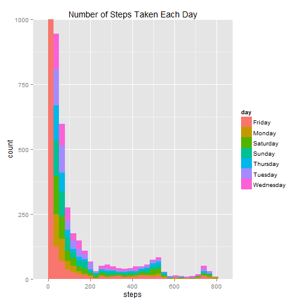
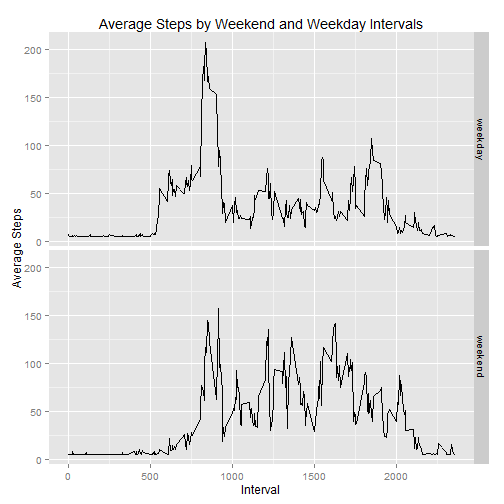

<<<<<<< HEAD
Simple Data Analysis of Personal Movement Monitoring Device
============================================================================================

This will be a simple data analysis of data from a personal activity monitoring device, like a FitBit. This device collects data at 5 minute intervals through out the day. The data consists of two months of data from an anonymous individual collected during the months of October and November, 2012 and include the number of steps taken in 5 minute intervals each day.

The data has the following information:

*steps: Number of steps taking in a 5-minute interval (missing values are coded as NA)

*date: The date on which the measurement was taken in YYYY-MM-DD format

*interval: Identifier for the 5-minute interval in which measurement was taken

### Loading and Preprocessing the Data

First we will need to read in the data and get an idea of what the data looks like, as well as load any libraries we will be using, in this case we will be using ggplot2 for plotting graphics:

```r
library(ggplot2)
setwd("E:/Documents/School/Coursera/5_Reproducible_Research/Project_1")
df <- read.csv("data/activity.csv",na.strings = "NA")
str(df)
```

```
## 'data.frame':	17568 obs. of  3 variables:
##  $ steps   : int  NA NA NA NA NA NA NA NA NA NA ...
##  $ date    : Factor w/ 61 levels "2012-10-01","2012-10-02",..: 1 1 1 1 1 1 1 1 1 1 ...
##  $ interval: int  0 5 10 15 20 25 30 35 40 45 ...
```

It seems that the data is nicely composed, however we need to change the date variable from a factor to a Date that R can work with, in this case as.Date() will work just fine. Let's also add a column fow which day of the week the activity was monitored:


```r
df$date <- as.Date(df$date)
df$day <- weekdays(df$date)
```


### Total number of steps taken per day

For this next part, we will make a histogram to see the total number of steps taken each day, ignoring the missing values:


```r
completes <- complete.cases(df)
temp_df <- df[completes,]
qplot(steps, data = temp_df, fill = day) + labs(title = "Number of Steps Taken Each Day")
```

```
## stat_bin: binwidth defaulted to range/30. Use 'binwidth = x' to adjust this.
```

 

As we can see, there is an excessive amount of observations with zero steps. Let's look at the data a little closer, maybe at count = 1000 for the max:


```r
qplot(steps, data = temp_df, fill = day) + coord_cartesian(ylim = c(0, 1000)) + labs(title = "Number of Steps Taken Each Day")
```

```
## stat_bin: binwidth defaulted to range/30. Use 'binwidth = x' to adjust this.
```

 


Another interesting thing we would like to know is the mean and median total number of steps taken per day:


```r
mean <- mean(df$steps, na.rm=TRUE)
median <- median(df$steps, na.rm=TRUE)
```

Our mean is 37.3825996. It's no surprise that the median is 0 with so many observations taken with zero steps.

### Average Daily Activity Pattern

Now, let's take a look at a time series plot of the 5-minute intervals and the average number of steps taken averaged across all days:


```r
# First compute the average steps for each interval
avgsteps <- tapply(temp_df$steps, temp_df$interval, mean)
# Since tapply returns a vector with dimnames, we want to extract those dimnames for use of plotting in ggplot2
interval <- as.numeric(unlist(dimnames(avgsteps)))
avgsteps <- as.numeric(avgsteps)
# And now for the plot
plot_data <- data.frame(interval, avgsteps)
g <- ggplot(plot_data, aes(x=interval, y=avgsteps))
g + geom_line() + labs(x = "Interval") + labs(y = "Average Steps") + labs(title = "Averaged Number of Steps Across Intervals")
```

 

Now it would be interesting to see which 5-minute interval contains the highest number of average steps:


```r
plot_data[plot_data$avgsteps == max(plot_data$avgsteps),]
```

```
##     interval avgsteps
## 104      835 206.1698
```

### Inputing Missing Values

In this data set, there is a considerable amount of missing values, which is easily calculated since we saved both the original data set and the temp_df data set:


```r
length(df$steps) - length(temp_df$steps)
```

```
## [1] 2304
```

For the sake of simplicity, let's go ahead and change those missing values to the mean number of steps for that day, but let's use the floor function to make sure the steps are still whole numbers:


```r
avgsteps <- floor(tapply(df$steps, df$date, mean, na.rm=TRUE))
head(avgsteps)
```

```
## 2012-10-01 2012-10-02 2012-10-03 2012-10-04 2012-10-05 2012-10-06 
##        NaN          0         39         42         46         53
```

As we can see, there is still a problem with this method, some days do not contain any data for the steps at all, producing average values of NaN. When this happens, we will just go ahead and fill in NaNs with the average amount of steps for all days:


```r
## First let's compute an overall average
avg <- floor(mean(df$steps, na.rm=TRUE))
## Now for each NA value, we need to replace it with the day average, and if no day average exists, we will replace it with the average of all the days
for(i in seq_along(df$steps)){
  if(is.na(df$steps[i])){
    if(is.nan(avgsteps[as.character(df$date[i])])){
      df$steps[i] <- avg
    }
    else {
      df$steps[i] <- as.numeric(avgsteps[as.character(df$date[i])])
    }
  }
}
```

Now, let's see if our histogram has changed at all with this new data:


```r
## Note: we are still using 1000 as our y-axis limit since there are still plenty of observations with zero for the number of steps
qplot(steps, data = df, fill = day) + coord_cartesian(ylim = c(0, 1000)) + labs(title = "Number of Steps Taken Each Day")
```

```
## stat_bin: binwidth defaulted to range/30. Use 'binwidth = x' to adjust this.
```

 

It does not look like much has changed at all. Maybe our mean and median have changed, let's take a look:


```r
new_mean <- mean(df$steps, na.rm=TRUE)
new_median <- median(df$steps, na.rm=TRUE)
```

It seems our median has remained at 0, however our mean has changed, but only slightly, from 37.3825996 to 37.3324226.

### Activity Patterns on Weekdays Versus Weekends

We want to see now how the activities vary over the weekend and the weekdays. To do this, we will need to create yet another column that will tell us whether or not a particular day is a weekend or weekday:


```r
# First replicate the day column to a weekend column
df$weekend <- df$day
# Now for every observation, we will see if the day is a weekday or weekend and code it properly in the weekend variable
for(i in seq_along(df$weekend)){
  if(df$day[i] == "Saturday" | df$day[i] == "Sunday"){
    df$weekend[i] <- "weekend"
  }
  else{
    df$weekend[i] <- "weekday"
  }
}
# We will save the partitions separately for easy computation of the averages later
weekend_df <- df[df$weekend == "weekend",] 
weekday_df <- df[df$weekend == "weekday",]
```

Now we can go ahead and compute the averages for steps among the weekend days or weekdays and look at some plots of the interval versus the number of steps:


```r
# First let's compute the average number of steps for weekend intervals
avgsteps1 <- tapply(weekend_df$steps, weekend_df$interval, mean)
# We want to save the intervals for plotting
interval <- as.numeric(unlist(dimnames(avgsteps1)))
avgsteps1 <- as.numeric(avgsteps1)
# Second, repeat the computations for weekdays
avgsteps2 <- tapply(weekday_df$steps, weekday_df$interval, mean)
avgsteps2 <- as.numeric(avgsteps2)
# Combine the average steps for weekends and weekdays for plotting
avgsteps <- c(avgsteps1, avgsteps2)
# Since there are the same intervals in both weekends and weekdays, we can just double up the interval to make a variable named weekday for the plot_data
interval <- c(interval,interval)
weekend <- c(rep("weekend", times = 288), rep("weekday", times = 288))
plot_data <- data.frame(interval, avgsteps, weekend)
# Now for the plot
g <- ggplot(plot_data, aes(x=interval, y=avgsteps))
g + geom_line() + facet_grid(weekend ~ .) + labs(x = "Interval") + labs(y = "Average Steps") + labs(title = "Average Steps by Weekend and Weekday Intervals")
```

 

Very interesting plots. While during the weekday, it seems that activity seems to be higher during the intervals of around 500 to 1000, but on the weekends it seems that activity is higher all around on average.

## Conclusion

This again was just a simple data analysis project for the course "Reproducible Research" provided by Johns Hopkins University through Coursera. We learned some interesting things, however, there is still much that can be learned with more data.

